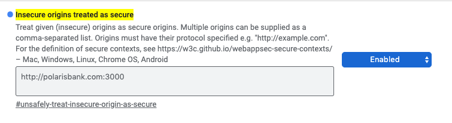
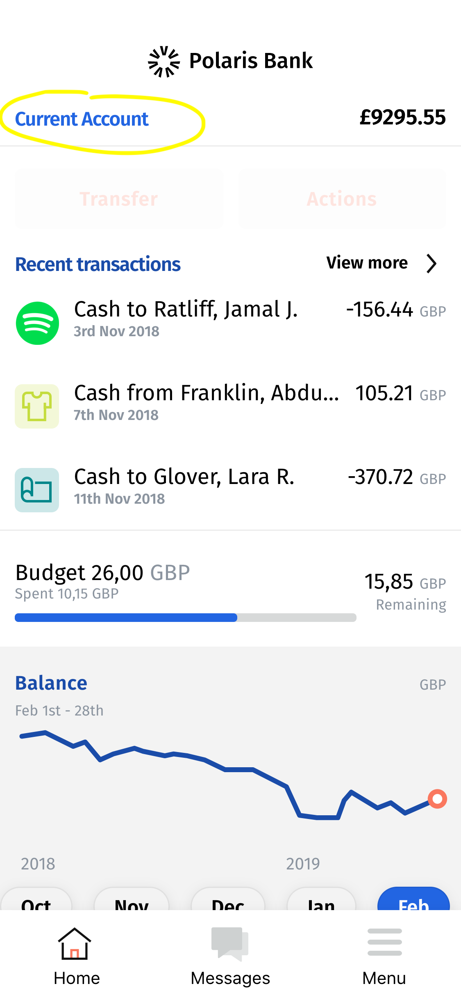
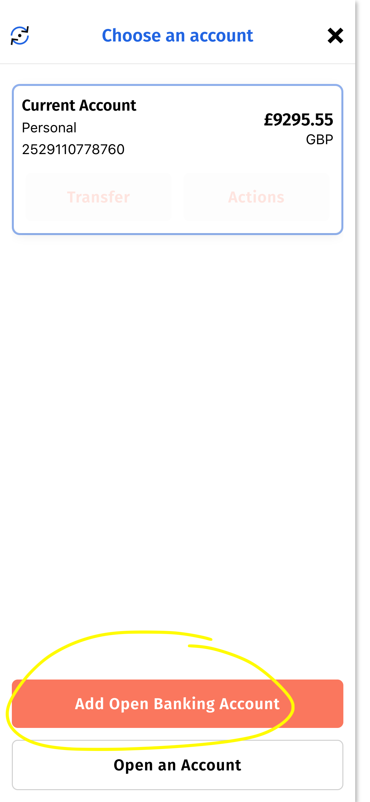
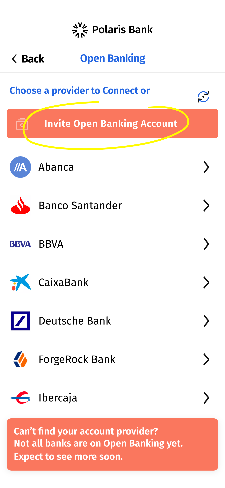
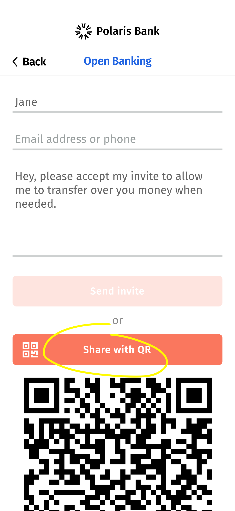
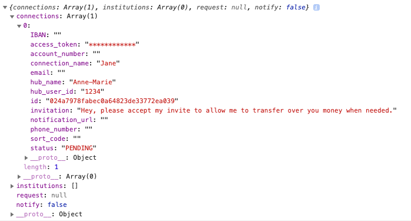
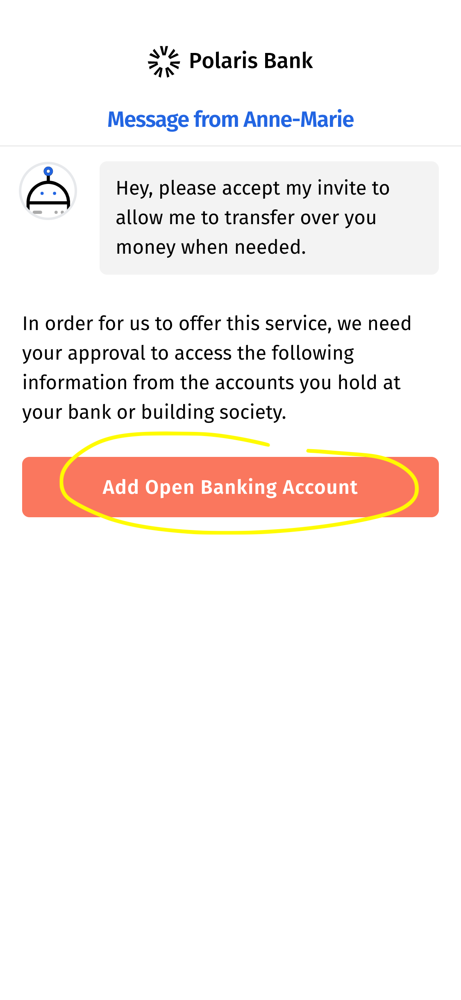
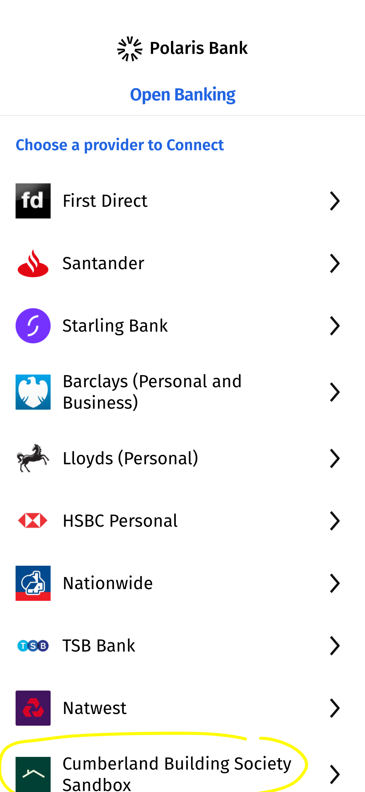
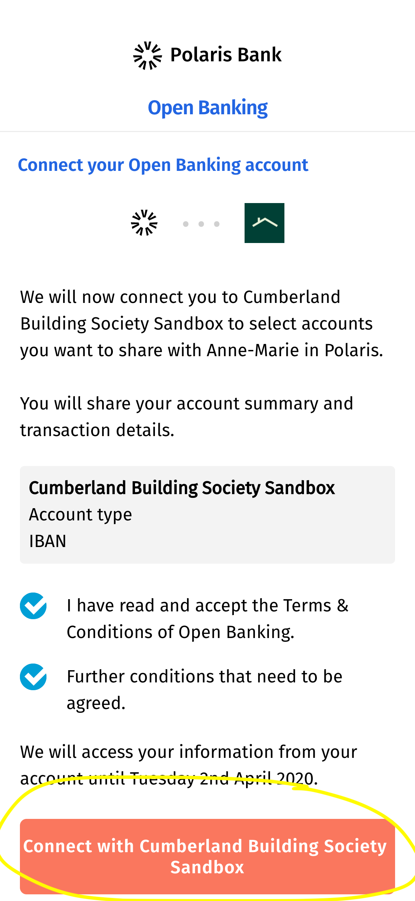
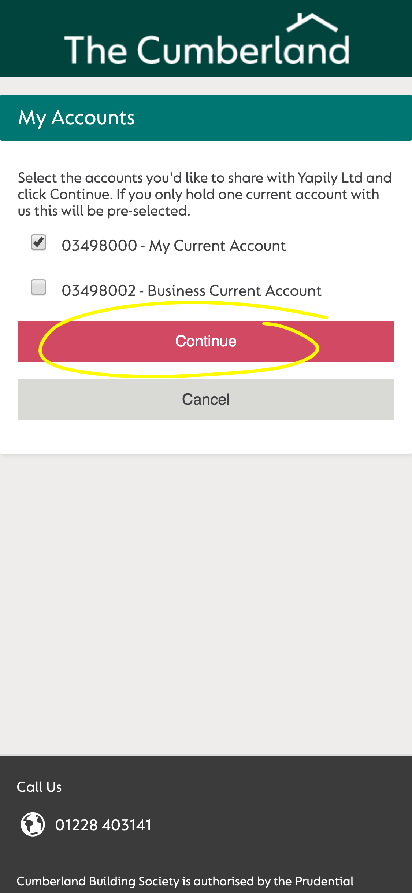

# Polaris Bank

Polaris Bank is an example application showcasing 'The next generation internet banking solution'. This example application shows customers how React Native and React can be combined to create highly cross-compatible applications over multiple channels.

A Polaris Bank demo is available at [polarisbank.nearform.com][polaris-nearform].

 This document is intended for developers who wish to experience Polaris Bank and describes how to install and run Polaris locally. It also includes a Polaris user journey, which in addition to the demo above, shows how users can experience Polaris Bank open banking. It consists of the following sections:

- [Install and Run Polaris](#Install-and-run-Polaris-on-a-Local-Machine) - Describes how to install and run Polaris on a local machine.
- [Explore the App ](#explore-the-app) - Configure Polaris to connect to the ForgeRock open banking app.
- [Invite User Journey](#invite-user-journey) - How to invite a user to connect to an open banking account.

## Install and Run Polaris on a Local Machine

Polaris is easy to install, run and use. 
Before starting, let's ensure you have all the prerequisites installed.

### 1. Clone the Source Repository

Fork Polaris on GitHub. It is easier to maintain your own fork as we have designed Polaris to diverge. 

After you have your fork, clone a copy of it locally using the command:

    git clone https://github.com/<your-fork>/open-banking-reference-app.git

### 2. Install Dependencies

Change directory to the root folder of the project. Run the following command to install the dependencies for the frontend application:

    npm install

To install server dependencies, run the command:

    cd server && npm install

### 3. Configure the Environment

Polaris uses `.env` files to configure Polaris packages. There are `.sample.env` files for each Polaris package documenting sample values that you can use in each `.env` file.

To generate a default set of .env files for all packages, run the following command in the root directory of the project:

    npm run create:env

### 4. Register for Open Banking

Polaris implements the [Open Banking][openbanking] standard.

To enable Polaris to fetch bank account details from your bank, you need to register with a bank and identity platform that supports open banking.

The easiest way to set this up for demonstration purposes is to contact us for some IBM credentials. Edit the `server.env` file to enter these credentials for the following variables: 
- IBM_CLIENT_ID
- IBM_CLIENT_SECRET
- IBM_CONNECTION_URL 
- IBM_OB_URL.

### 5. Configure the IBM Watson Assistant Chatbot (Optional)

Polaris includes a chatbot called [IBM Watson Assistant][watson] to show how a conversation with your bank might look. This step is optional - if you skip this step, the assistant does not respond, but Polaris still works.

Configure Polaris with the IBM Watson Assistant as follows:
1. Sign up for a [free account][ibmdashboard] - you are on the assistant page.
1. Click the user icon, and select **IBM Cloud Dashboard** to go to the [IBM cloud dashboard][ibmdashboard].
1. Click the **Services** link in the 'Resource summary' section.
1. Click the **Assistant** link under Services in the 'Resource list'. The assistant URL and key are displayed. 
1. Edit the `/server/.env` file to enter the displayed API key and URL value for the variables WATSON_ASSISTANT_URL and WATSON_API_KEY.
1. Click **Launch Watson Assistant** to return to the assistant page you started on.
1. Click the three dot menu icon to the far right of 'My first assistant'. Select **Settings** on the menu. 
1. On the Assistant settings page, select **API details** on the left hand menu.
1. Edit the file `/server/.env` to enter the displayed Assistant ID value for the variable WATSON_ASSISTANT_ID.

Polaris is now configured with the IBM Watson Assistant. However, the assistant's only response is 'I didn't understand. You can try rephrasing'. To build responses, edit the Skill section on the assistant overview page.

## Run Polaris

You are now all set to run Polaris. To start the server, run:

```sh
cd server && npm run build && npm start
```

To start the web version, open another terminal and from the project root directory run the command:

```sh
npm run start:web
```

This automatically opens an [Expo] console in your browser that displays the phase of the Polaris build process. When Expo finishes building Polaris, it automatically opens another tab running Polaris.

Congratulations! You are now running Polaris locally.

### Run Polaris on Native Devices

To run Polaris on native devices, install the Expo app (Expo Client on the App Store or Expo on the Play Store). Use the app to scan the QR code displayed in the left panel of the [Expo] console.

## Explore the App

The home page uses mock data for demonstration purposes. Connection to a real open bank account is [demonstrated in this video](https://www.youtube.com/watch?v=5Dj_zaKmbVM).

To enable Polaris to run locally while connecting to a real open banking app use the following steps.

### 1. Configure the Environment

Before running the application, configure your environment variables as described below.

1. For the frontend, in the `.env` file set `REACT_APP_UI_BASE` to `http://polarisbank.com:3000`. This is an alias to your local machine that is used in the backend configuration as a callback URL. Use the default values provided in the sample file for all other variables.
1. Add the following entry to your host file `127.0.0.1 polarisbank.com`.
1. For the backend environment variables you need to source the appropriate open banking and IBM credentials.
1. Restart the server and the client as described in the instructions above.

Once you have both applications running, allow the service worker to run on an unsecured domain (the polarisbank.com alias) as follows:
1. In Chrome open the page [chrome://flags/#unsafely-treat-insecure-origin-as-secure](chrome://flags/#unsafely-treat-insecure-origin-as-secure), add an entry for `http://polarisbank.com:3000`, toggle the flag from disabled to enabled and restart Chrome, as shown below.

   

   If you are using Firefox, open [Settings](about:config). Set both `dom.webnotifications.allowinsecure` and `dom.serviceWorkers.testing.enabled` to `true`. This way you'll be allowed to see notifications on a HTTP domain.

1. Open the application in Chrome [http://polarisbank.com:3000](http://polarisbank.com:3000). A message to enable notification is displayed. Click **Allow** to enable a web push notification flow further in the user journey.
Don't forget to allow notifications when your browser asks for consent!

### Set up ForgeRock Bank Integration

This process is difficult and error prone. It consists of the steps below. Please follow each step carefully.
- [Create a ForgeRock Directory Account](#create-a-ForgeRock-Directory-Account).
- [Create a ForgeRock Bank Account](#create-a-ForgeRock-Bank-Account).
- [Register your Third Party Provider (TPP) with Postman](#Register-your-third-party-provider-(TPP)-with-postman).
- [Add your ForgeRock account to the Polaris Bank App](#Add-your-ForgeRock-account-to-the-polaris-bank-app).

#### Create a ForgeRock Directory Account

1. Browse to [ForgeRock Directory][forgerock-directory] and create an account.
   **Caution:** Don't forget your _username_, as authentication doesn't work with your _email_.

1. On the dashboard, click **Create a new software statement**.

1. Select the **Transport/Signing/Encryption keys** tab and scroll to **Keys** section.

1. Click the download (cloud) button of your _Transport_ key:

   1. Save the Public certificate (.pem) as your `server/crt.crt` file.
   1. Save the Private key (.key) as your `server/key.key` file.

1. **Log out**. If you forget to log out, you'll have trouble completing the next step.

#### Create a ForgeRock Bank Account

1. Browse to [ForgeRock Bank][forgerock-bank] and create an account.
   **Caution:** Don't forget your _username_, as authentication doesn't work with your _email_.
   We recommend using a different username from the Directory account above, to avoid confusion.

1. **Log out**.

#### Register your Third Party Provider (TPP) with Postman

1. Download [Postman][postman]. Don't use the web extension; install the desktop app on your laptop.

1. Open the Postman app and import their collection and environment as follows:

   1. Select **Import** on the menu bar for collection.
   1. Select the **Link** tab and enter the following URL in the field provided: https://raw.githubusercontent.com/ForgeRock/obri-postman/master/ForgeRock%20OBRI%20Sample%20(Generated).postman_collection.json. Select **Import**. (**Note:** Use the ForgeRock [github account][collection-github], if the link is invalid).
   1. Download the environment file from https://raw.githubusercontent.com/ForgeRock/obri-postman/master/Environment/OBRI%20ob%20(Generated).postman_environment.json and save it locally.
   1. In the Postman app, click the cog icon. The Manage Environments modal is displayed. Select **Import** and select the environment file you downloaded in the previous step.
   1. Close the "Manage Environments" modal.
   1. Select the **ORBI ob (Generated)** environment in the environment dropdown box on the Postman app homepage.

1. Configure a certificate in Postman:

   1. In the **Settings** menu (spanner icon on the menu bar), select the **Certificates** tab.
   1. Click **Add Certificate**.
   1. Enter `*.ob.forgerock.financial` in the Host field.
   1. Select your file `server/crt.crt` as the CRT file.
   1. Select your file `server/key.key` as the KEY file.
   1. No passphrase nor PFX file is required. Click **Add** to save the certificate.

1. Using the Collections tab on the left pane, open the `ForgeRock ORBI Sample (Generated)` folder.

1. Set up your Postman variables by running queries from the following subfolders:

   1. `Setup your environment/Test MATLS`: run all queries in order. They should all succeed.
   1. `Setup your environment/Discovery`: run all queries in order. They should all succeed and set the global variables.

1. Onboard your TPP:

   1. Edit the request body of the `Dynamic Registration/Onboarding your TPP/Generate registration JWT - FR Tool API` query. **Carefully set up your redirect_uris**.
   1. Run all queries in the `Dynamic Registration/Onboarding your TPP` folder in order. They should all succeed.

1. Your TPP is ready to use!

#### Add your ForgeRock account to the Polaris Bank App

1. Open http://polarisbank.com:3000/overview.

1. Tap **Current Account**.

1. Tap **Add Open Banking Account**.

1. Select **ForgeRock Bank**.

1. When redirected to `https://bank.ob.forgerock.financial/login`, log in with the same _username_ and _password_ you used on [ForgeRock Bank][forgerock-bank].

#### Additional Notes

_Caution:_ The imported account is hardcoded as a Santander account with no transactions.

The ForgeRock certificate and private key shipped for development were created with the directory account `damien`/`Password`.
The corresponding bank account is `damien-customer`/`Password`.

Refer to the [ForgeRock Documentation][forgerock-doc] for more details.

### Invite User Journey
This section describes a user journey where a user invites someone to connect their account. It consists of both the [inviter journey](#inviter-journey) and [invitee journey](#invitee-journey).

#### Inviter Journey
1. Tap **Current Account** on the Polaris Bank app overview page.

   

1. Tap **Add Open Banking Account**.

   

1. Tap **Invite Open Banking Account**.

   

1. Enter a name and invitation message in the fields provided. For simplicity, we share with a QR code which generates a URL that the invitee can use. When you've entered the required details, tap **Share with QR code** to generate a code.

   

#### Invitee Journey
This section describes the invitee journey to connect the accounts after they receive a connect invitation. 

1. In the Chrome dev tools console paste the following code to access the connection ID, `JSON.parse(localStorage.getItem("@PolarisBank:state")).connection.connections.pop().id`.

   You could also scan the QR code and browse to the encoded URL.

   

1. Open a new tab and navigate to [`http://polarisbank.com:3000/connect/<id>`](http://polarisbank.com:3000/connect/<id>) where `<id>` is the ID from the previous step. This displays the invitation page to allow invitees to connect their open banking account. 
1. Tap **Add Open Banking Account**.

   

1. Tap **Cumberland Building Society Sandbox**.

   

1. Confirm the connection by ticking the checkboxes and tapping the **Connect with Cumberland Building Society Sandbox**.

   

1. The Cumberland Open Banking Sandbox website is displayed. Log in using one of their test accounts. You can find details at: [https://www.cumberland.co.uk/developers/neon/download/file/PDFs/sandbox-instructions.pdf](https://www.cumberland.co.uk/developers/neon/download/file/PDFs/sandbox-instructions.pdf).

1. When logged in, select an account to connect and tap **Continue**.

   

   Once this process is complete you are redirected back to the Polaris application, indicating the invitee account was successfully connected.

   

In the **Current Account** section of the Polaris app, you now see the connected open banking app below the mock current account, with active **Transfer** and **Actions** buttons.

<!-- External Links -->

[polaris-nearform]: https://polarisbank.nearform.com/
[expo]: https://expo.io/
[openbanking]: https://www.openbanking.org.uk/
[watson]: https://www.ibm.com/cloud/watson-assistant/
[ibmdashboard]: https://cloud.ibm.com/
[forgerock-doc]: https://docs.ob.forgerock.financial/
[postman]: https://www.postman.com/downloads/
[collection-github]: https://github.com/ForgeRock/obri-postman
[forgerock-directory]: https://directory.ob.forgerock.financial/dashboard
[forgerock-bank]: https://bank.ob.forgerock.financial/register
